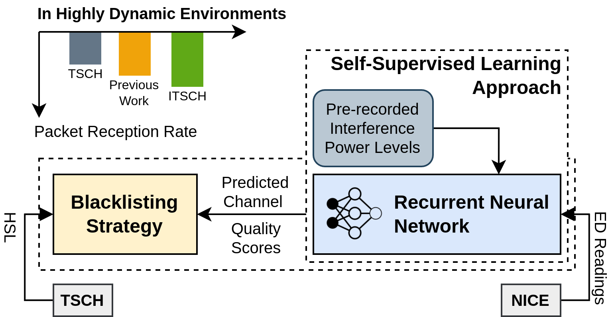
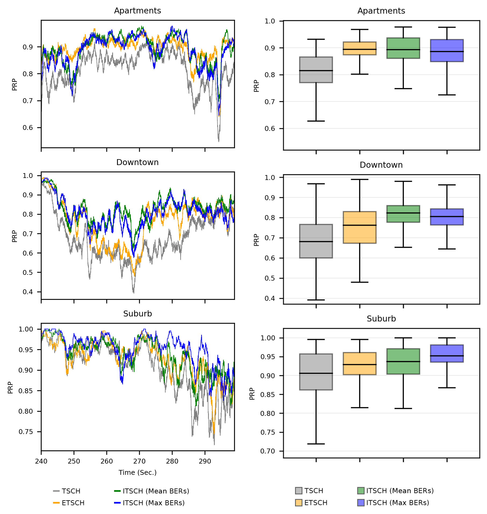
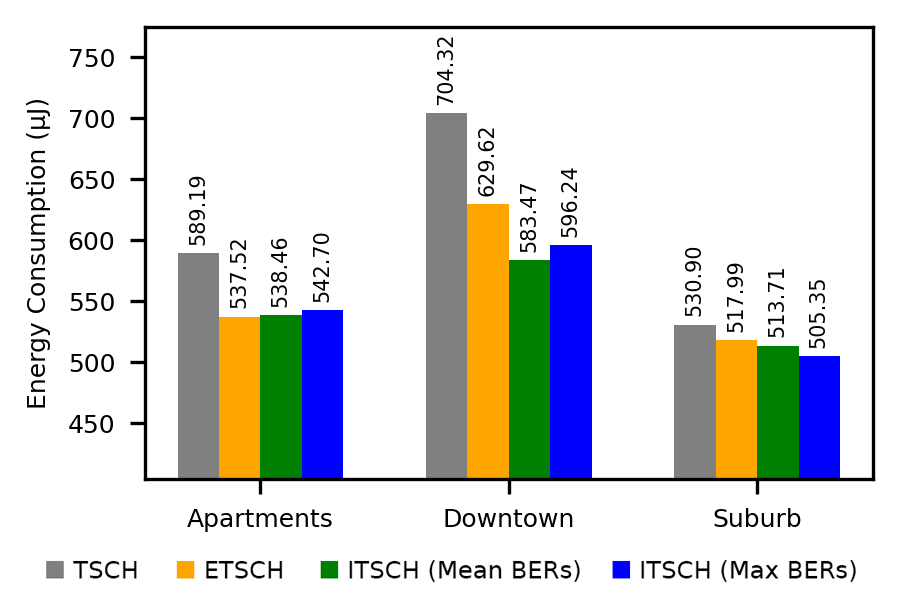

Our paper has been published in the IEEE Sensors journal, 2021!

> Farahmand, Mohammad, and Nabi, Majid. "[Channel Quality Prediction for TSCH Blacklisting in Highly Dynamic Networks: 
A Self-Supervised Deep Learning Approach](https://ieeexplore.ieee.org/abstract/document/9467294)." 
IEEE Sensors Journal 21, no. 18 (2021): 21059-21068.

# Abstract

Cross-Technology Interference (CTI) is a severe issue for wireless networks operating in the license-free ISM bands. In particular, CTI can significantly affect the performance of low-power wireless links used in the Internet-of-Things (IoT). The IEEE 802.15.4 standard adopts a channel hopping scheme in its Time-Slotted Channel Hopping (TSCH) mode as a means to mitigating the adverse effect of CTI. However, the indiscriminate procedure by which TSCH nodes hop over different channels can suffer from severe interference in specific channels. Adaptive channel blacklisting is a technique to alleviate this issue by leaving out low-quality channels from the hopping list. To enable an effective blacklisting, especially in highly varying networks, an accurate real-time prediction of the quality of all available channels is of paramount importance. Previous studies rely on the past records of the channels as an indication of their quality in near future. Evidently, such approaches cannot extend to highly dynamic environments. This paper present a self-supervised approach for training deep neural networks capable of predicting the future behaviour of the frequency channels. The trained models can then substitute the quality assessment approaches in blacklisting schemas. Considering in-vehicle wireless networks as a target application, we evaluate this idea using a real-world experimental dataset, consisting of three measurement scenarios inside a moving vehicle. The experimental results show that using the proposed technique for TSCH blacklisting significantly improves the reliability of networks experiencing such highly dynamic interference and performs at least as good as the existing channel assessment methods in low-interference conditions.

# Results

In highly stochastic environments, our solution performs significantly better than previous approaches, bringing down
the energy consumption of the devices considerably.





# Data


Please refer to the [dedicated webpage](https://www.es.ele.tue.nl/~rtavakoli/content/software.php) in order to download
the dataset, **Interference in In-vehicle Networks**. You will have to convert the MATLAB files into PyTorch tensors 
and save them in the `data` directory, with the `.pt` extension. The scripts expect three sets of measurements: 
`apartments`, `downtown`, and `suburb`.

# Simulation

Run `simulation.py` to simulate the IEEE 802.15.4 protocol on the available measurements. We expect the results to
closely resemble those reported in [the paper](https://www.es.ele.tue.nl/~rtavakoli/content/publications.php) 
that originally introduced the dataset. 

# Training

You must run `main.py` to train the model. You have to pass in the name of a measurement set, which will then used for
training and testing, according to the schema discussed in the paper. The optional arguments for this script are as
follows:

```
  --train               if not passed, loads saved model and performs evaluation only.
  --train-split         in seconds. default is 240.
  --eval-limit          in seconds. default is 300.
  --sample-rate         dataset sample rate. default is 2000.
  --target-rate         sample rate of the data fed to the network. default is 10.
  --power               tran. power in dBm. default is -10.
  --alpha               path-loss exponent. default is 3.5.
  --distance            assumed to be 3 in Eqn. 5
  --packet-length       in bytes. default is 133.
  --past-window         denoted as t_p in the paper. default is 5 seconds.
  --future-window       denoted as t_f in the paper. default is 5 seconds.
  --layers              number of recurrent layers. refer to the paper.
  --neurons             number of recurrent neurons. refer to the paper.
  --iterations          number of iterations to train for. default is 1000.
  --batch-size          training batch size. default is 32.
```

# Analysis

Run `analysis.py` in order to generate the figures shown in the paper. You can limit the measurements and models 
considered by passing their names as arguments. For more details, refer to the script.
